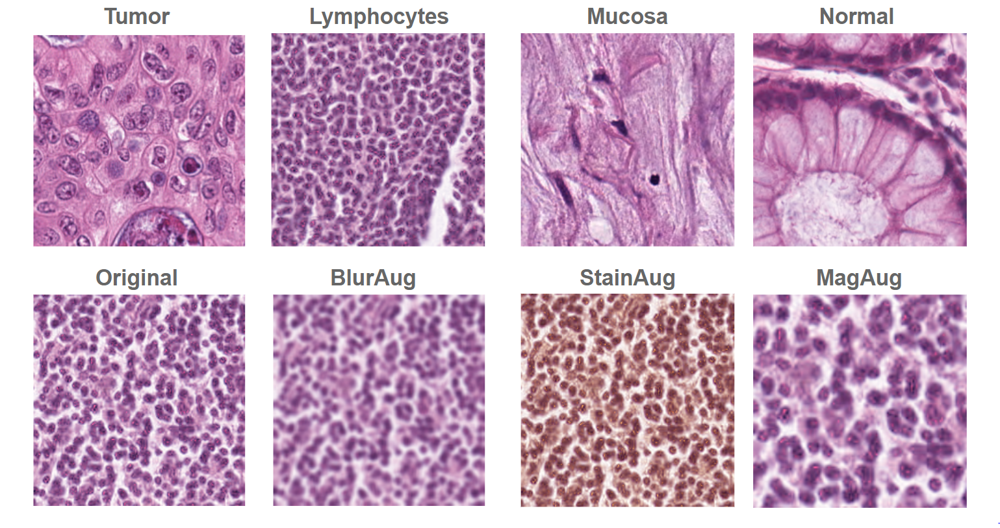
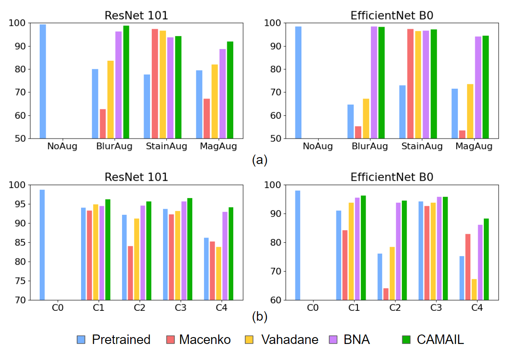

# CAMAIL
Confidence Assisted Model Adaptation via Iterative Learning

## CAMAIL Schematic

## Visualization of Kather-19 dataset and synthetic test sets

## Unsupervised Domain Adaptation results
We have compared the performances of CAMAIL with Vahadane and Macenko stain normalization techniques and Batch Normalization Adaptation. CAMAIL shows to result in state-of-the-art domain generalization performance.

